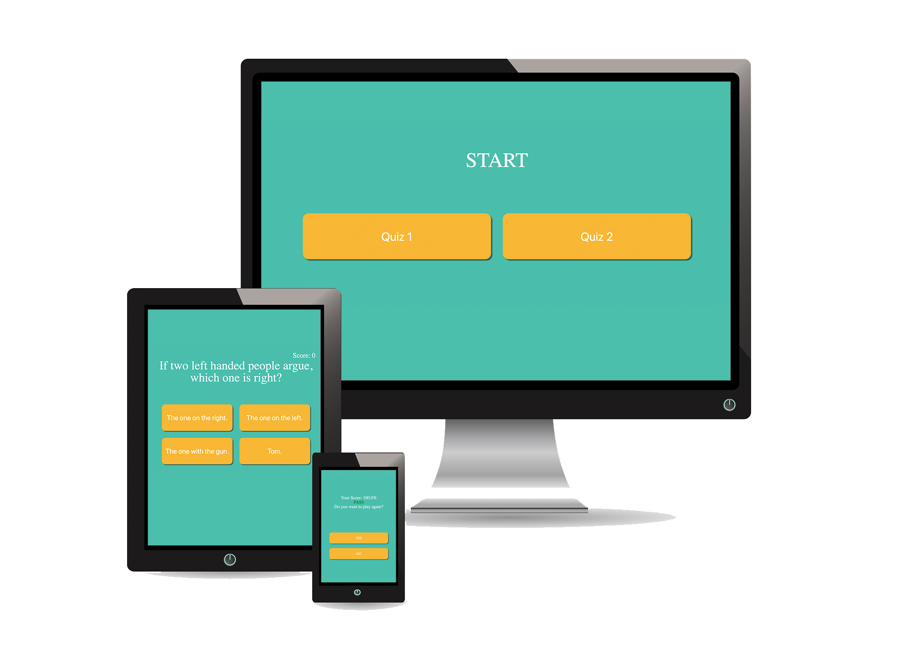

# App Developer Entrance Project

Created a client-side quiz app based on the provided requirements, data and views.



Image by <a href="https://pixabay.com/users/Tumisu-148124/?utm_source=link-attribution&amp;utm_medium=referral&amp;utm_campaign=image&amp;utm_content=492184">Tumisu</a> from <a href="https://pixabay.com/?utm_source=link-attribution&amp;utm_medium=referral&amp;utm_campaign=image&amp;utm_content=492184">Pixabay</a>

## Setup

This project can be viewed via the GitHub Pages link in the descripting, or you can clone it and follow these instructions:

1. with the previous technologies installed you can now run `npm install` to now install the dev dependencies associated with the project

2. with the technologies and dependencies installed you can now run and view the site!

## Summary

This is a straight forward quiz app that uses data from a local JSON file via the JavaScript `fetch()` api.

The app tests the users selected answers and compares them to the JSON file data:

```js
{
  quizzes: [{
    title: 'Quiz 1',
    questions: [{
      question: 'Question 1?'
      answers: [{
        content: 'Answer 1.',
        value: false // wrong answer
      }, {
        content: 'Answer 2.',
        value: true // correct answer
      }]
    }]
  }]
}
```

I took some liberty with the styles using SASS and a Gulp pipe to take advantage of variables and mixins, as well as making the project both mobile and desktop friendly.

I followed the project requirements:

- load either quiz 1 or quiz 2 on click after page load
- While the user is selecting their answers:
  - display all 3 questions with possible answers
  - provide feedback when a user clicks on an answer by using RED or GREEN
  - show the next question after a time delay of 2 seconds
  - track the number of correct answers in the top right corner
- When the user has finished answering all three questions:
  - display the final score
  - show a "pass" message if more than 50% of the answers were correct, show a "fail" message otherwise

## Key Learnings

### HTML

- used semantic class and id names to reference in SCSS and JavaScript
- demonstrated effective organization of directory by implementing file and folder naming and categorizing best practices
- included essential HTML elements in both head and body of the index

### SASS / CSS 

- used a preprocessor to effectively use variables, partials, and mixins to create scalable code
- used appropriate selectors and kept code DRY and not over-specific
- demonstrated effective use of box model, flexbox, and CSS grid properties
- demonstrated effective use of font properties to implement design concepts

### Javascript     

- defined variables using appropriate types, let and const
- used semantically named functions and variables to keep code easy to read and relevant
- used strict equality operators where needed
- used loops, functions, and conditionals to effectively implement JavaScript

### [Gulp](https://gulpjs.com/)

- used appropriate developer dependencies for the scope of the project
  - [gulp](https://www.npmjs.com/package/gulp) - task automation toolkit
  - [gulp-terser](https://www.npmjs.com/package/gulp-terser) - compresses JS files
  - [gulp-rename](https://www.npmjs.com/package/gulp-rename) - renames compressed files in /build directory
  - [browserSync](https://www.npmjs.com/package/browser-sync) - keeps browser in sync during development
  - [gulp-eslint](https://www.npmjs.com/package/gulp-eslint) - identifies and reports errors and patterns
  - [gulp-sass](https://www.npmjs.com/package/gulp-sass) - normalizes SCSS files into browser ready CSS files
  - [gulp-autoprefixer](https://www.npmjs.com/package/gulp-autoprefixer) - parses CSS and adds vendor, or browser, prefixes
  - [gulp-cssnano](https://www.npmjs.com/package/gulp-cssnano) - compresses CSS files
  - [gulp-prettyError](https://www.npmjs.com/package/gulp-prettyerror) - displays errors in a pretty way without breaking tasks

### [Git](https://git-scm.com/)

- created a repository both locally and in the cloud with GitHub
- effectively used git push to upload my local repository to my remote repository
- used commits to follow version control best practices
- effectively used command line and commands on iTerm2 to initiate and commit git repositories
